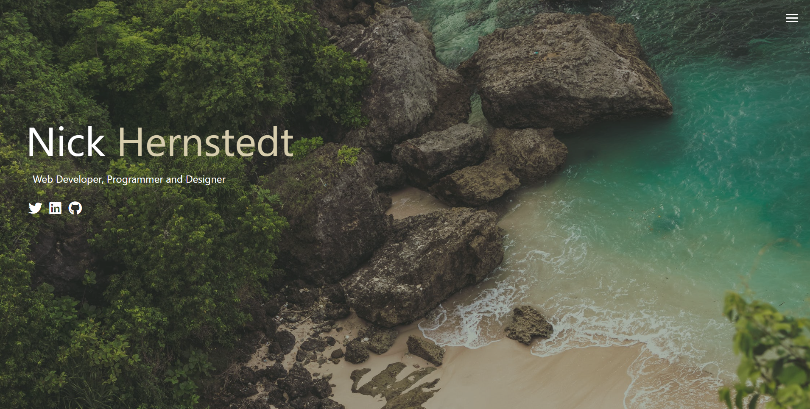

# Responsive Portfolio
A place to showcase some of my work and practice some of my skills

## Site URL
https://nick-hernstedt.github.io/ResponsivePortfolio/
## What it is
This portfolio is a place to show off some of my work. It does the following:
- showcases some of the skills that I have
- displays my projects with links to them and their github
- provides contact information
##

## 

## Technologies
- Responsive Design
- HTML
- CSS
- Sass
- Javascript

## User story
AS A person wanting to display their work,
I WANT to build an easy-to-use website that will provide me a place to show off my work without too many buttons or confusing UI elements,
SO THAT prospective employers can see some of my work.

GIVEN a portfolio website,

WHEN I click the hamburger icon,
THEN I am shown navigation options.

WHEN I click the projects link,
THEN I am shown shown some of the projects I have done with links to both them and the github.

WHEN I click the contact me link,
THEN an area appears with some of my contact info.

When I click the about me link,
THEN I am taken to a page with some about me info
